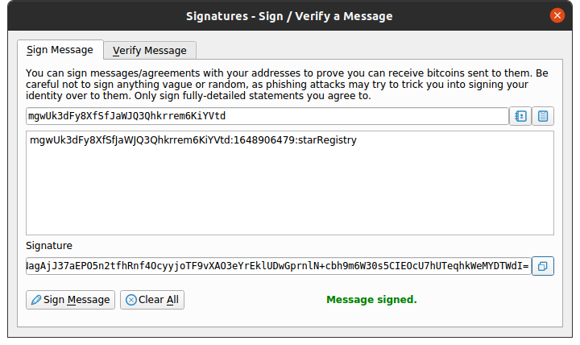

# Private Blockchain Application

This repository is my solution to the first project of the Udacity "Blockchain Developer" Nanodegree. Below, you find some more information as well as some helpful screenshots.

## What problem does this private Blockchain application solve?

Your employer is trying to make a test of concept on how a Blockchain application can be implemented in his company.
He is an astronomy fan and he spends most of his free time on searching stars in the sky, that's why he would like
to create a test application that will allow him to register stars, and also some other of his friends can register stars, but making sure the application knows who owned each star.

### What is the process to be implemented in the application?

1. The application will create a Genesis Block when we run the application.
2. The user will request the application to send a message to be signed using a Wallet and in this way verify the ownership over the wallet address. The message format will be: `<WALLET_ADRESS>:${new Date().getTime().toString().slice(0,-3)}:starRegistry`;
3. Once the user has the message the user can use a wallet to sign it.
4. The user will try to submit the Star object for that it will submit: `wallet address`, `message`, `signature` and the `star` object with the star information.
    The Star information will be formed in this format:
    ```json
        "star": {
            "dec": "68° 52' 56.9",
            "ra": "16h 29m 1.0s",
            "story": "Some story"
		}
    ```
5. The application will verify if the time elapsed from the request of ownership (the time is contained in the message) until the time when the user submits the star is less than 5 minutes.
6. If everything is okay the star information will be stored in the block and added to the chain.
7. The application will allow us to retrieve the Star objects belonging to an owner (by their wallet address). 


## Dependencies

Some of the libraries this project uses are:
- "bitcoinjs-lib": "^4.0.3",
- "bitcoinjs-message": "^2.0.0",
- "body-parser": "^1.18.3",
- "crypto-js": "^3.1.9-1",
- "express": "^4.16.4",
- "hex2ascii": "0.0.3",
- "morgan": "^1.9.1"

Libraries' purpose:

- `bitcoinjs-lib` and `bitcoinjs-message`. Those libraries help to verify the wallet address ownership, we are going to use it to verify the signature.
- `express` The REST API created for the purpose of this project is created using Express.js framework.
- `body-parser` this library will be used as middleware module for Express and helps to read the JSON data submitted in a POST request.
- `crypto-js` This module contains some of the most important cryptographic methods and helps to create the block hash.
- `hex2ascii` This library helps to **decode** the data saved in the body of a Block.

## Understanding the code

The code is a simple architecture for a Blockchain application, it includes a REST API application to expose the Blockchain application methods to client applications or users.

1. `app.js` contains the configuration and initialization of the REST API.
2. `BlockchainController.js` contains the routes of the REST API. 
3. `src` folder contains `block.js` and `blockchain.js` that contain the `Block` and `BlockChain` classes.

### Using this code

First, install all the libraries and module dependencies: `npm install`

Next, run the project: `node app.js`

You can check in your terminal that the Express application is listening on the PORT 8000. Feel free to use POSTMAN to interact with the application.

Now you can interact directly from a browser or using, e.g., POSTMAN.


## Screenshots showing app functionality

1. Using POSTMAN to request the Genesis block:

    

The screenshots in the project documentation do not match the current end point in the `BlockchainController.js` file. The correct endpoint is `/block/height/:height`. For the Genesis block, this looks like this

2. Requesting validation using a wallet address: 

    


3. Signing the message with a wallet:
    

    Using Bitcoin Core, I followed the hint given [here]() on how to create a legacy address (by adding `address=legacy` to the `bitcoin.conf` file before startup).

4. Submitting a new Star
     


5. Retrieving Stars owned by a specific wallet address
    

    This is the output after having added an additional star in between (no extra screenshot, compare with screenshot 4).


